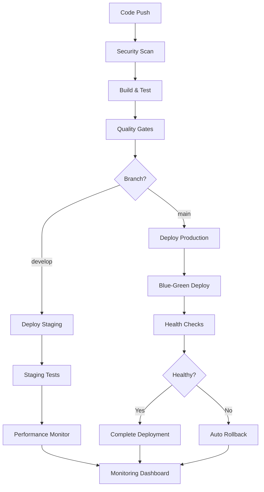

# 🚀 Enhanced Deployment & CI/CD Guide

This document covers the enhanced deployment and CI/CD pipeline for SwiftConcur, including multi-stage deployments, security scanning, performance monitoring, and rollback capabilities.

## 📋 Table of Contents

- [Overview](#overview)
- [Pipeline Architecture](#pipeline-architecture)
- [Environment Configuration](#environment-configuration)
- [Deployment Process](#deployment-process)
- [Security & Compliance](#security--compliance)
- [Monitoring & Observability](#monitoring--observability)
- [Rollback Procedures](#rollback-procedures)
- [Troubleshooting](#troubleshooting)
- [Best Practices](#best-practices)

## 🏗️ Overview

The enhanced CI/CD pipeline provides:

- **Multi-stage deployments** (Development → Staging → Production)
- **Comprehensive security scanning** (dependencies, secrets, containers, code analysis)
- **Performance monitoring** with automatic rollback on degradation
- **Blue-green deployments** for zero-downtime production releases
- **Automated rollback** capabilities with health monitoring
- **Compliance reporting** and security attestation

## 🏛️ Pipeline Architecture



## 🎯 Environment Configuration

### Development Environment
- **Purpose**: Feature development and integration testing
- **Auto-deploy**: Feature branches (optional)
- **URL**: `https://dev.gradualsystems.io/SwiftConcur`

### Staging Environment
- **Purpose**: Pre-production testing and validation
- **Auto-deploy**: `develop` branch
- **URL**: `https://staging.gradualsystems.io/SwiftConcur`
- **Health Checks**: Basic monitoring
- **Performance Thresholds**: 2s response time, 5% error rate

### Production Environment
- **Purpose**: Live user traffic
- **Auto-deploy**: `main` branch (with approval)
- **URL**: `https://gradualsystems.io/SwiftConcur`
- **Health Checks**: Comprehensive monitoring
- **Performance Thresholds**: 1s response time, 1% error rate
- **Rollback**: Automatic on failure

## 🔄 Deployment Process

### Automated Deployment Flow

1. **Code Push/PR**
   ```bash
   git push origin feature/new-feature
   # Triggers: security scan, build, test
   ```

2. **Security & Quality Gates**
   - Dependency vulnerability scan
   - Secrets detection
   - Static code analysis
   - Container security scan
   - Code quality metrics

3. **Staging Deployment** (develop branch)
   ```yaml
   # Automatically triggered on develop branch push
   Environment: staging
   Health Checks: Basic
   Rollback: Automatic on failure
   ```

4. **Production Deployment** (main branch)
   ```yaml
   # Requires approval for production
   Environment: production
   Deployment Strategy: Blue-Green
   Health Checks: Comprehensive
   Monitoring Period: 15 minutes
   ```

### Manual Deployment

For emergency deployments or specific version releases:

```bash
# Trigger manual deployment
gh workflow run enhanced-ci.yml \
  --field environment=production \
  --field skip_tests=false

# Trigger specific version deployment
gh workflow run enhanced-release.yml \
  --field version_type=patch \
  --field deploy_after_release=true
```

## 🔒 Security & Compliance

### Security Scanning Pipeline

The security pipeline runs multiple scans:

1. **Dependency Security Audit**
   - Rust: `cargo audit` + `cargo deny`
   - Node.js: `npm audit` for dashboard and API
   - Vulnerability database: Updated daily

2. **Secrets & Sensitive Data Scan**
   - TruffleHog for comprehensive secret detection
   - Pattern-based scanning for common sensitive data
   - Environment file validation

3. **Static Code Analysis**
   - Advanced Clippy analysis with pedantic rules
   - Unsafe code detection with `cargo geiger`
   - CodeQL analysis for JavaScript/TypeScript

4. **Container Security**
   - Trivy vulnerability scanning
   - Docker best practices with Hadolint
   - Base image security validation

### Security Thresholds

- **Critical Vulnerabilities**: Deployment blocked
- **High Vulnerabilities**: Warning, review required
- **Secrets Detection**: Deployment blocked
- **Container Critical Issues**: Deployment blocked

### Compliance Reporting

Security reports are generated for each deployment:
- Executive summary with risk assessment
- Detailed vulnerability breakdown
- Compliance status (COMPLIANT/WARNING/NON-COMPLIANT)
- Remediation recommendations

## 📊 Monitoring & Observability

### Health Checks

#### Basic Health Checks (All Environments)
- Application startup and responsiveness
- Database connectivity
- API endpoint availability
- Authentication service status

#### Advanced Health Checks (Production)
- End-to-end user flows
- Third-party service integration
- Performance metrics validation
- Business logic verification

### Performance Monitoring

Real-time performance tracking:

```yaml
Metrics:
  - Response Time: P50, P95, P99
  - Error Rate: 4xx and 5xx responses
  - Throughput: Requests per second
  - Resource Usage: CPU, Memory, Disk

Thresholds:
  Staging:
    - Response Time: <2s
    - Error Rate: <5%
  Production:
    - Response Time: <1s
    - Error Rate: <1%
```

### Alerting

Automated alerts for:
- Deployment failures
- Performance degradation
- Security vulnerabilities
- Health check failures

Notification channels:
- Slack: `#deployments`, `#alerts`
- Email: Operations and development teams
- GitHub: Status checks and PR comments

## 🔄 Rollback Procedures

### Automatic Rollback

Automatic rollback is triggered when:
- Health checks fail for >5 minutes
- Performance metrics breach thresholds
- Error rate exceeds 5% for >2 minutes
- Critical security vulnerability detected

### Manual Rollback

#### Emergency Rollback
```bash
# Immediate rollback to previous version
gh workflow run deployment-monitor.yml \
  --field action=rollback \
  --field environment=production \
  --field rollback_version=v1.2.3
```

#### Planned Rollback
```bash
# Rollback with proper validation
gh workflow run enhanced-release.yml \
  --field version_type=rollback \
  --field rollback_version=v1.2.3 \
  --field create_github_release=false
```

### Rollback Process

1. **Backup Current State**
   - Database snapshot
   - Configuration backup
   - Tagged release for recovery

2. **Deploy Previous Version**
   - Blue-green deployment to minimize downtime
   - Gradual traffic shifting
   - Continuous health monitoring

3. **Validation**
   - Health checks pass
   - Performance metrics normal
   - User functionality verified

4. **Cleanup**
   - Remove failed deployment artifacts
   - Update monitoring dashboards
   - Post-incident analysis

## 🛠️ Troubleshooting

### Common Issues

#### Deployment Stuck in Pending
```bash
# Check workflow status
gh run list --workflow=enhanced-ci.yml

# Cancel stuck run
gh run cancel <run-id>

# Restart deployment
gh workflow run enhanced-ci.yml --ref main
```

#### Health Checks Failing
```bash
# Manual health check
curl -f https://gradualsystems.io/SwiftConcur/api/health

# Check application logs
# (Logs location depends on hosting platform)

# Force rollback if needed
gh workflow run deployment-monitor.yml \
  --field action=rollback \
  --field environment=production
```

#### Performance Issues
```bash
# Run performance analysis
gh workflow run deployment-monitor.yml \
  --field action=performance_test \
  --field environment=production

# Check monitoring results
gh run download <run-id> --name monitoring-results
```

### Debug Mode

Enable detailed logging for troubleshooting:
```bash
gh workflow run enhanced-ci.yml \
  --field environment=staging \
  --field debug_mode=true
```

## ✅ Best Practices

### Development Workflow

1. **Feature Development**
   ```bash
   git checkout -b feature/new-feature
   # Develop feature
   git push origin feature/new-feature
   # Create PR to develop branch
   ```

2. **Testing in Staging**
   ```bash
   git checkout develop
   git merge feature/new-feature
   git push origin develop
   # Automatic staging deployment
   ```

3. **Production Release**
   ```bash
   git checkout main
   git merge develop
   git push origin main
   # Production deployment with approval
   ```

### Security Best Practices

- **Secrets Management**: Use GitHub secrets, never commit sensitive data
- **Dependency Updates**: Regular security updates via Dependabot
- **Code Review**: Security-focused reviews for all changes
- **Least Privilege**: Minimal permissions for deployment tokens

### Performance Optimization

- **Monitoring**: Continuous performance monitoring
- **Caching**: Aggressive caching for static assets
- **CDN**: Global content delivery network
- **Database**: Optimized queries and indexing

### Deployment Safety

- **Gradual Rollout**: Blue-green deployments for zero downtime
- **Health Monitoring**: Comprehensive health checks
- **Rollback Readiness**: Always have a rollback plan
- **Communication**: Keep stakeholders informed

## 📚 Additional Resources

- [GitHub Actions Documentation](https://docs.github.com/en/actions)
- [Vercel Deployment Guide](https://vercel.com/docs)
- [Cloudflare Workers Documentation](https://developers.cloudflare.com/workers/)
- [Supabase Deployment Guide](https://supabase.com/docs/guides/platform/going-to-prod)

## 🆘 Support & Contact

For deployment issues or questions:
- **Documentation**: Check this guide and linked resources
- **GitHub Issues**: Create an issue for bugs or feature requests
- **Team Slack**: `#swiftconcur-deployments` channel
- **Emergency Contact**: ops@gradualsystems.io

---

**Last Updated**: $(date -u)  
**Version**: v2.0  
**Maintained By**: SwiftConcur DevOps Team