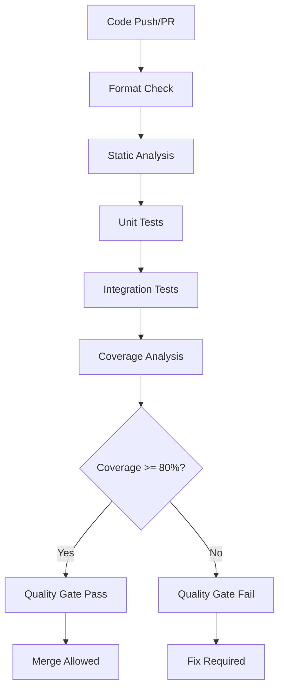

# 🧪 SwiftConcur Testing Guide

This guide covers the comprehensive testing strategy for SwiftConcur, including automated test execution, coverage reporting, and quality gates.

## 📋 Table of Contents

- [Overview](#overview)
- [Test Structure](#test-structure)
- [Running Tests](#running-tests)
- [Coverage Requirements](#coverage-requirements)
- [Quality Gates](#quality-gates)
- [CI/CD Integration](#cicd-integration)
- [Writing Tests](#writing-tests)
- [Troubleshooting](#troubleshooting)

## 🎯 Overview

SwiftConcur employs a multi-layered testing strategy:

- **Unit Tests**: Test individual components in isolation
- **Integration Tests**: Test component interactions and workflows
- **End-to-End Tests**: Test complete user workflows
- **Performance Tests**: Validate performance characteristics
- **Security Tests**: Verify security requirements

### Test Coverage Requirements

| Component | Minimum Coverage | Quality Gate |
|-----------|------------------|--------------|
| Rust Parser | 80% | ✅ Enforced |
| Dashboard | 80% | ✅ Enforced |
| API | 80% | ✅ Enforced |
| Overall | 80% | ✅ Enforced |

## 🏗️ Test Structure

```
swiftconcur/
├── parser/
│   ├── src/                    # Source code
│   ├── tests/
│   │   ├── fixtures/           # Test data files
│   │   ├── integration_tests.rs
│   │   └── sample_sources/     # Sample Swift code
│   ├── benches/                # Performance benchmarks
│   └── tarpaulin.toml         # Coverage configuration
├── dashboard/
│   ├── __tests__/              # Test files
│   │   ├── components/
│   │   ├── lib/
│   │   └── utils/
│   ├── __mocks__/              # Mock implementations
│   ├── jest.config.js          # Jest configuration
│   └── jest.setup.js           # Test setup
├── api/
│   ├── tests/                  # Test files
│   │   ├── integration/
│   │   ├── middleware/
│   │   ├── models/
│   │   ├── services/
│   │   └── setup.ts           # Test setup
│   └── vitest.config.ts       # Vitest configuration
└── scripts/
    └── test.sh                # Test execution script
```

## 🚀 Running Tests

### Local Testing

#### Quick Test (All Components)
```bash
./scripts/test.sh
```

#### Component-Specific Tests
```bash
# Rust parser tests
./scripts/test.sh parser

# Dashboard tests
./scripts/test.sh dashboard

# API tests
./scripts/test.sh api

# Integration tests only
./scripts/test.sh integration
```

#### Test Options
```bash
# Run without coverage
./scripts/test.sh --no-coverage

# Run in watch mode
./scripts/test.sh dashboard --watch

# Update test snapshots
./scripts/test.sh --update-snapshots

# Run with verbose output
./scripts/test.sh --verbose

# Run tests sequentially (not parallel)
./scripts/test.sh --no-parallel
```

### Individual Component Tests

#### Rust Parser
```bash
cd parser

# Format check
cargo fmt --all -- --check

# Linting
cargo clippy --all-targets --all-features -- -D warnings

# Unit tests
cargo nextest run --workspace --all-features

# Doctests
cargo test --doc --workspace

# Coverage report
cargo tarpaulin --workspace --engine llvm --out html --out xml
```

#### Dashboard
```bash
cd dashboard

# Install dependencies
npm ci

# Type checking
npx tsc --noEmit

# Linting
npm run lint

# Tests with coverage
npm test -- --coverage --watchAll=false

# Tests in watch mode
npm test
```

#### API
```bash
cd api

# Install dependencies
npm ci

# Type checking
npx tsc --noEmit

# Tests with coverage
npx vitest run --coverage

# Tests in watch mode
npx vitest
```

## 📊 Coverage Requirements

### Coverage Thresholds

**Rust Parser (tarpaulin.toml)**
```toml
[tarpaulin]
fail-under = 80.0
engine = "llvm"
out = ["Html", "Xml", "Json"]
```

**Dashboard (jest.config.js)**
```javascript
coverageThreshold: {
  global: {
    branches: 80,
    functions: 80,
    lines: 80,
    statements: 80,
  },
  './components/**/*.{js,jsx,ts,tsx}': {
    branches: 75,
    functions: 75,
    lines: 75,
    statements: 75,
  },
  './lib/**/*.{js,jsx,ts,tsx}': {
    branches: 85,
    functions: 85,
    lines: 85,
    statements: 85,
  }
}
```

**API (vitest.config.ts)**
```typescript
coverage: {
  thresholds: {
    global: {
      branches: 80,
      functions: 80,
      lines: 80,
      statements: 80,
    },
    'src/services/**/*.{js,ts}': {
      branches: 85,
      functions: 85,
      lines: 85,
      statements: 85,
    }
  }
}
```

### Coverage Reports

After running tests with coverage, reports are available at:
- **Combined Report**: `coverage/combined/index.html`
- **Rust Report**: `coverage/rust/tarpaulin-report.html`
- **Dashboard Report**: `dashboard/coverage/lcov-report/index.html`
- **API Report**: `api/coverage/index.html`

## 🚦 Quality Gates

### Automated Quality Gates (CI)

1. **Code Formatting**: Must pass `cargo fmt` and `npm run lint`
2. **Static Analysis**: Must pass Clippy and ESLint with zero warnings
3. **Test Execution**: All tests must pass
4. **Coverage Threshold**: Must meet minimum coverage requirements
5. **Security Scans**: Must pass dependency and security audits

### Gate Enforcement

Quality gates are enforced at multiple levels:

- **Pre-commit**: Format checking and basic linting
- **PR Creation**: Full test suite execution
- **Pre-merge**: All quality gates must pass
- **Pre-deployment**: Security and performance validation

### Bypassing Quality Gates

Quality gates can only be bypassed with:
1. **Admin Override**: Repository admin approval
2. **Emergency Release**: With documented justification
3. **Security Fix**: With security team approval

## 🔄 CI/CD Integration

### GitHub Actions Workflows

#### Automated Tests Workflow (`.github/workflows/automated-tests.yml`)

Runs on every push and PR:
- Parallel execution across components
- Coverage collection and reporting
- Quality gate enforcement
- PR comment with test results

#### Enhanced CI Workflow (`.github/workflows/cy.yml`)

Integrates with automated tests:
- Fast feedback with basic tests
- Triggers comprehensive test suite
- Codecov integration for coverage tracking

### Test Execution Flow



### Coverage Tracking

- **Codecov Integration**: Automatic coverage uploads
- **PR Comments**: Coverage reports in pull requests
- **Trend Tracking**: Coverage history and trends
- **Badge Generation**: Coverage badges for README

## ✍️ Writing Tests

### Rust Tests

#### Unit Tests
```rust
#[cfg(test)]
mod tests {
    use super::*;
    
    #[test]
    fn test_warning_parsing() {
        let input = include_str!("fixtures/sample_warning.json");
        let result = parse_warnings(input).unwrap();
        assert_eq!(result.warnings.len(), 1);
    }
    
    #[test]
    fn test_markdown_formatting() {
        let warnings = vec![create_sample_warning()];
        let markdown = format_as_markdown(&warnings);
        assert!(markdown.contains("## Swift Concurrency Warnings"));
    }
}
```

#### Integration Tests
```rust
// tests/integration_tests.rs
use std::process::Command;

#[test]
fn test_cli_with_fixture() {
    let output = Command::new("./target/release/swiftconcur-parser")
        .args(&["-f", "tests/fixtures/sample.json", "--format", "json"])
        .output()
        .expect("Failed to execute command");
        
    assert!(output.status.success());
    let result: serde_json::Value = serde_json::from_slice(&output.stdout).unwrap();
    assert!(result["warnings"].is_array());
}
```

### Dashboard Tests

#### Component Tests
```typescript
// components/__tests__/StatCard.test.tsx
import { render, screen } from '@testing-library/react'
import { StatCard } from '../StatCard'

describe('StatCard', () => {
  it('renders stat information correctly', () => {
    render(
      <StatCard 
        title="Total Warnings" 
        value={42} 
        trend="+5%" 
        trendDirection="up" 
      />
    )
    
    expect(screen.getByText('Total Warnings')).toBeInTheDocument()
    expect(screen.getByText('42')).toBeInTheDocument()
    expect(screen.getByText('+5%')).toBeInTheDocument()
  })
  
  it('handles loading state', () => {
    render(<StatCard title="Loading" value={null} loading={true} />)
    expect(screen.getByRole('progressbar')).toBeInTheDocument()
  })
})
```

#### Hook Tests
```typescript
// lib/__tests__/useRealtime.test.tsx
import { renderHook, waitFor } from '@testing-library/react'
import { useRealtime } from '../useRealtime'

describe('useRealtime', () => {
  it('subscribes to realtime updates', async () => {
    const { result } = renderHook(() => useRealtime('warnings'))
    
    await waitFor(() => {
      expect(result.current.isConnected).toBe(true)
    })
  })
})
```

### API Tests

#### Unit Tests
```typescript
// src/handlers/__tests__/warnings.test.ts
import { describe, it, expect, vi } from 'vitest'
import { handleWarnings } from '../warnings'

describe('warnings handler', () => {
  it('processes warning data correctly', async () => {
    const mockRequest = {
      json: vi.fn().mockResolvedValue({
        warnings: [{ type: 'actor-isolation', severity: 'high' }]
      })
    }
    
    const response = await handleWarnings(mockRequest)
    expect(response.status).toBe(200)
  })
  
  it('validates input data', async () => {
    const mockRequest = {
      json: vi.fn().mockResolvedValue({})
    }
    
    const response = await handleWarnings(mockRequest)
    expect(response.status).toBe(400)
  })
})
```

#### Integration Tests
```typescript
// tests/integration/api.test.ts
import { describe, it, expect } from 'vitest'

describe('API Integration', () => {
  it('handles full workflow', async () => {
    const response = await fetch('/api/warnings', {
      method: 'POST',
      headers: { 'Content-Type': 'application/json' },
      body: JSON.stringify({
        warnings: [{ type: 'sendable', count: 5 }]
      })
    })
    
    expect(response.status).toBe(200)
    const data = await response.json()
    expect(data.processed).toBe(true)
  })
})
```

## 🔧 Troubleshooting

### Common Issues

#### "Tests are not running"
```bash
# Check if test files exist
find . -name "*.test.*" -o -name "*.spec.*"

# Verify test script permissions
ls -la scripts/test.sh

# Run specific component
./scripts/test.sh parser --verbose
```

#### "Coverage below threshold"
```bash
# Run coverage analysis
./scripts/test.sh --coverage

# Check uncovered lines
# Rust: Check coverage/rust/tarpaulin-report.html
# Dashboard: Check dashboard/coverage/lcov-report/index.html
# API: Check api/coverage/index.html

# Add tests for uncovered code
```

#### "Tests timing out"
```bash
# Increase timeout in configuration files:
# - Jest: testTimeout: 60000
# - Vitest: testTimeout: 60000
# - Cargo: timeout = 300 in tarpaulin.toml
```

#### "Dependency conflicts"
```bash
# Clean and reinstall dependencies
cd dashboard && rm -rf node_modules && npm ci
cd api && rm -rf node_modules && npm ci

# Clear Rust cache
cd parser && cargo clean
```

### Performance Optimization

#### Slow Test Execution
```bash
# Use parallel execution (default)
./scripts/test.sh --parallel

# Use nextest for Rust (faster)
cargo install cargo-nextest --locked
cargo nextest run

# Use vitest for API (faster than jest)
npx vitest run
```

#### Large Coverage Reports
```bash
# Use minimal reporters
cargo tarpaulin --out json  # Instead of html
npx vitest run --coverage.reporter=json  # Instead of html
```

### Debug Mode

#### Enable Verbose Logging
```bash
# Test script
./scripts/test.sh --verbose

# Rust tests
RUST_LOG=debug cargo test

# Node.js tests
DEBUG=* npm test
```

#### Test Debugging
```bash
# Run single test
cargo test test_name -- --exact
npm test -- --testNamePattern="test name"

# Show test output
cargo test -- --nocapture
npm test -- --verbose
```

## 📚 Additional Resources

- [Jest Documentation](https://jestjs.io/docs/getting-started)
- [Vitest Documentation](https://vitest.dev/guide/)
- [Cargo Test Documentation](https://doc.rust-lang.org/cargo/commands/cargo-test.html)
- [Tarpaulin Documentation](https://github.com/xd009642/tarpaulin)
- [Testing Library Documentation](https://testing-library.com/docs/)

---

**Last Updated**: $(date -u)  
**Version**: v1.0  
**Maintained By**: SwiftConcur Development Team